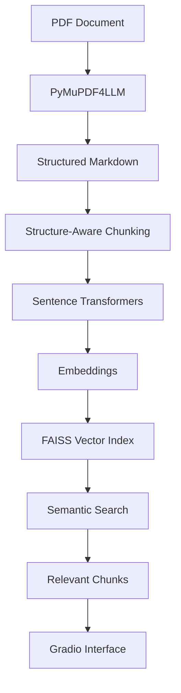

# AI-Document-Intelligence-using-Semantic-Search
AI Document Intelligence using Semantic Search

Project Link:https://huggingface.co/spaces/ssbb2026/AIDocIntelligence

An AI-powered document retrieval system that extracts content from PDF documents, converts the content into structure-aware chunks, generates semantic embeddings, and retrieves the most relevant information using FAISS vector search.

The system also provides an interactive Gradio interface for uploading PDFs and performing semantic searches without needing to interact with the Python backend directly.

## Technologies

- Python
- PyMuPDF4LLM
- Sentence Transformers
- FAISS
- NumPy
- Gradio

## Architecture

PDF
→ 
PyMuPDF4LLM
→ 
Markdown
→ 
Structure-aware Chunking
→ 
Sentence Transformers
→ 
FAISS
→ 
Semantic Search
→
Relevance Scoring
→ 
Gradio


**Features**
PDF Text Extraction

Extracts text and document structure from PDF files using PyMuPDF4LLM and converts the content into Markdown while preserving useful structural information.

**Structure-Aware Chunking**

Instead of splitting documents blindly by character count, the system uses document structure such as headings and sections to create more meaningful chunks.

This improves retrieval quality because related information remains grouped together.

**Metadata**

Each chunk can retain metadata such as:

Source document
Page number
Section or heading
Chunk identifier
Other document-level information

Metadata makes retrieved results easier to trace back to their original location.

**Semantic Embeddings**

The system uses Sentence Transformers to convert text chunks into numerical vector representations.

These embeddings capture the semantic meaning of the text, allowing the system to find relevant information even when the search query does not use the exact wording found in the document.

**FAISS Vector Search**

FAISS is used to efficiently index and search the generated embeddings.

Given a query, the system:

Generates an embedding for the query.
Searches the FAISS index.
Finds the closest document chunks.
Returns the most relevant results.
Relevance Scoring

Search results are ranked according to their vector similarity to the query, allowing the most relevant chunks to appear first.

**Gradio Interface**

A Gradio-based interface provides an easy way to interact with the retrieval system.

Users can:

Upload a PDF document.
Process and index the document.
Enter a natural-language query.
Retrieve the most relevant document sections.
Inspect the returned content and metadata.

This makes the project usable without requiring users to manually run individual processing steps from Python.

**How It Works**
1. **Upload PDF**

The user provides a PDF document through the Gradio interface.

2. **Extract Content**

PyMuPDF4LLM processes the PDF and converts its contents into Markdown.

PDF → Markdown

3.**Chunk the Document**

The Markdown document is divided into structure-aware chunks.

Each chunk represents a meaningful section of the document rather than an arbitrary piece of text.

Markdown
 → 
Headings / Sections
 → 
Meaningful Chunks
4.**Generate Embeddings**

Each chunk is passed through a Sentence Transformer model to generate a semantic embedding.

Text Chunk → Sentence Transformer → Vector

5.**Build FAISS Index**

The generated vectors are stored in a FAISS index for efficient similarity search.

Document Chunks
→ 
Embeddings
→ 
FAISS Index
6. **Search**

When the user submits a query, the query is converted into an embedding using the same embedding model.

FAISS then compares the query vector against the indexed document vectors and returns the closest matches.

User Query
→ 
Query Embedding
→ 
FAISS Similarity Search
→ 
Top Relevant Chunks

Installation

Clone the repository:

git clone <repository-url>

cd <repository-directory>

Create a virtual environment:

python -m venv venv

Activate the environment.

Windows
venv\Scripts\activate
Linux / macOS
source venv/bin/activate

Install the dependencies:

pip install -r requirements.txt
Running the Application

Start the Gradio application:

python app.py

The application will provide a local Gradio URL that can be opened in a browser.

**Using the Gradio Interface**

The typical workflow is:

Upload PDF
    → 
Process Document
    → 
Create Chunks
    → 
Generate Embeddings
    → 
Build FAISS Index
    → 
Enter Search Query
    → 
Retrieve Relevant Results

For example, after uploading a technical PDF, a user could search:

What are the main security requirements?

The system will return the document chunks that are semantically closest to the query, along with available metadata such as the source document and page information.

**Project Structure**

A possible project structure is:

## 📁 Project Structure

```text
project/
│
├── app.py                    # Gradio application
├── requirements.txt          # Python dependencies
├── README.md                 # Project documentation
│
├── data/
│   └── documents/            # PDF documents
│
├── src/
│   ├── pdf_processor.py      # PDF extraction & Markdown conversion
│   ├── chunker.py            # Structure-aware chunking
│   ├── embeddings.py         # Embedding generation
│   ├── vector_store.py       # FAISS index management
│   └── retriever.py          # Semantic retrieval
│
└── indexes/
    └── ...                   # Generated FAISS indexes
```

The exact structure can be adjusted according to the implementation.

**Retrieval Pipeline**

The complete retrieval process can be summarized as:

## 🔄 Project Workflow


### ✅ Implementation Highlights

- **PDF Processing:** Extracted and converted PDF content into structured Markdown using PyMuPDF4LLM.
- **Intelligent Chunking:** Applied structure-aware chunking to preserve document context.
- **Semantic Representation:** Generated dense vector embeddings using Sentence Transformers.
- **Vector Search:** Built and managed FAISS indexes for efficient similarity search.
- **Information Retrieval:** Retrieved the most relevant document chunks based on semantic similarity.
- **User Interface:** Integrated the complete pipeline into an interactive Gradio application.
- 
## 📦 Requirements

The main dependencies in this project are:

- PyMuPDF4LLM
- Sentence Transformers
- FAISS
- Gradio

They can be installed using:

pip install -r requirements.txt


**Advantages**

Retrieves information based on semantic meaning rather than exact keyword matching.
Preserves document structure during chunking.
Supports metadata associated with retrieved content.
FAISS provides efficient vector similarity search.
Gradio provides a simple and interactive user interface.
The architecture can be extended to support larger document collections.
Limitations
Retrieval quality depends on the selected embedding model.
Very complex PDF layouts may not extract perfectly.
Chunk size and chunking strategy can affect search quality.
FAISS retrieves similar text but does not independently generate an answer.
Large document collections may require more advanced indexing and storage strategies.
Future Improvements

**Potential improvements include:**

Support for multiple PDF documents.
Persistent vector databases.
Hybrid keyword + semantic search.
Query expansion and reranking.
Improved table and image extraction.
Retrieval-Augmented Generation (RAG) with an LLM.
Citation generation with page references.
Authentication for the Gradio application.
Cloud deployment.
Incremental document indexing.
Support for additional document formats.

**Use Cases**

This system can be used for:

Research paper search
Technical documentation retrieval
Legal document search
Academic document analysis
Company knowledge bases
Internal documentation search
Large PDF collections
Question answering pipelines

